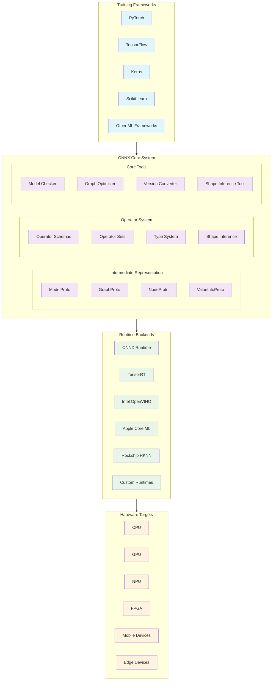
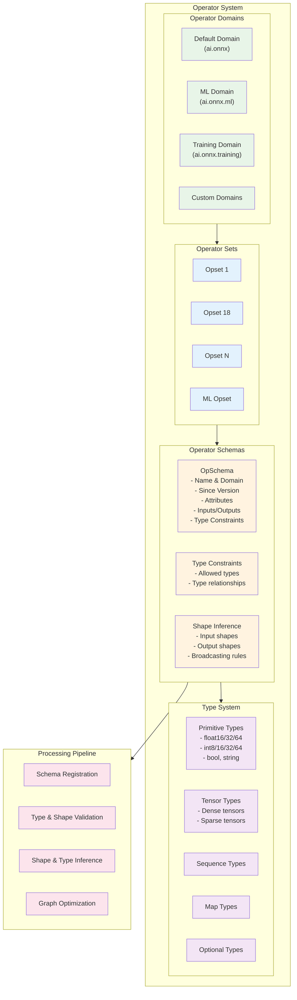
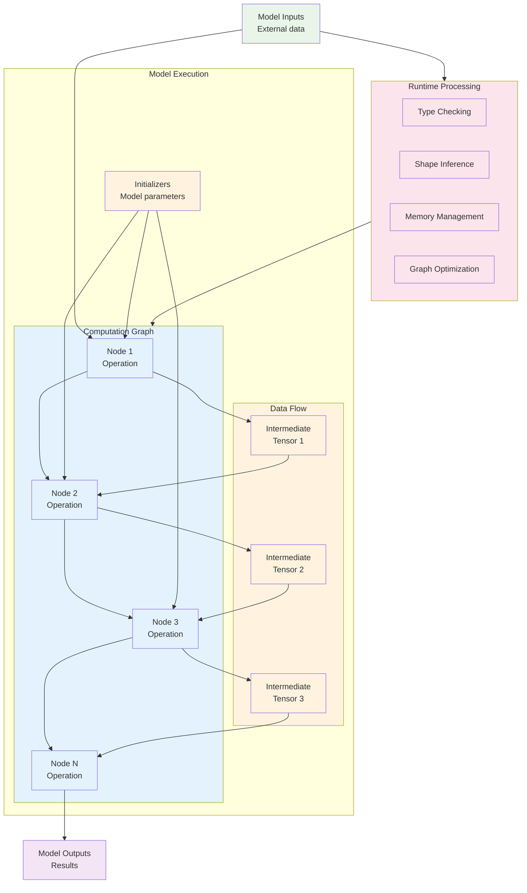
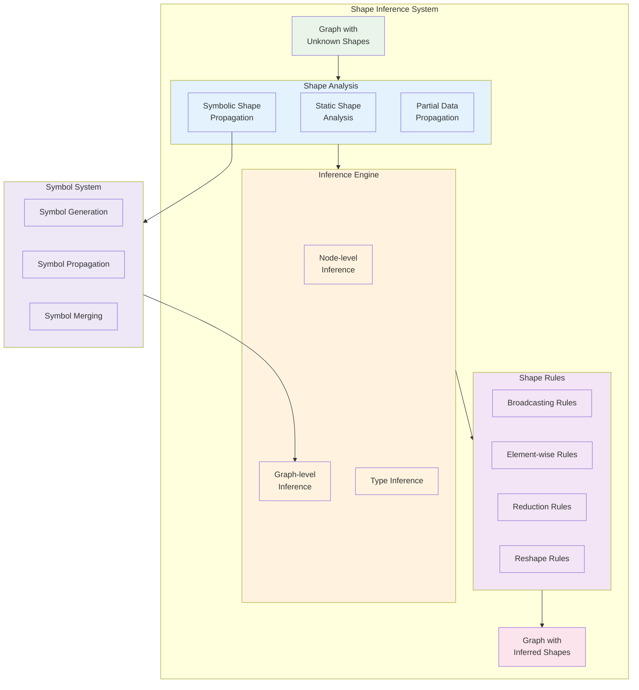
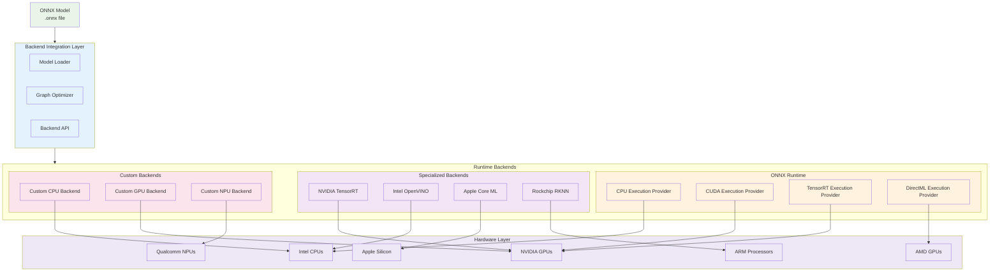
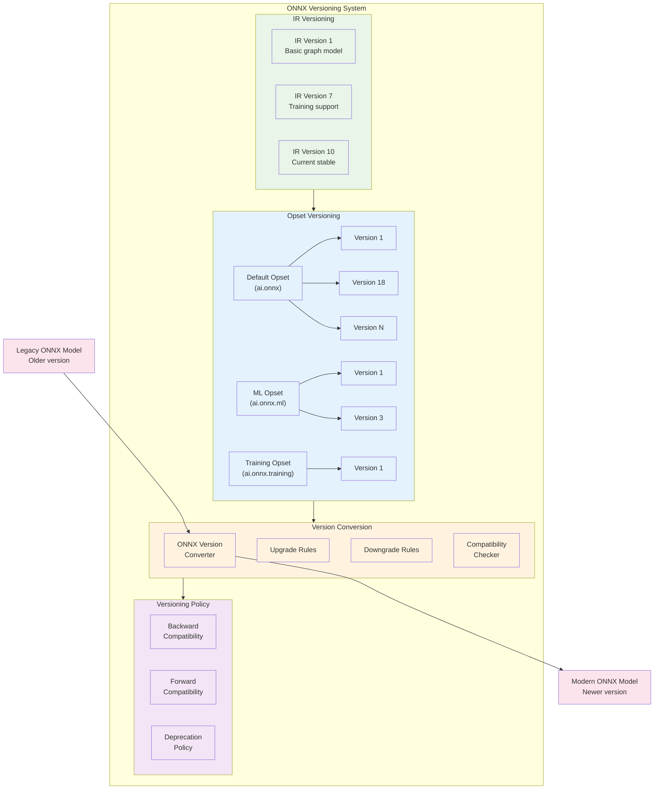

<!--
Copyright (c) ONNX Project Contributors

SPDX-License-Identifier: Apache-2.0
-->

# ONNX Technical Architecture

This document provides a comprehensive overview of the ONNX (Open Neural Network Exchange) technical architecture, including detailed diagrams that illustrate the system's components, data flows, and interactions.

## Overview

ONNX is an open ecosystem that empowers AI developers to choose the right tools as their project evolves. It provides an open source format for AI models and defines an extensible computation graph model, built-in operators, and standard data types.

## System Architecture

The following diagram shows the high-level architecture of the ONNX ecosystem:



## Model Representation Architecture

ONNX models are represented using Protocol Buffers. The following diagram shows the hierarchical structure:

```mermaid
graph TD
    Model["ModelProto<br/>Top-level container"]
    
    Model --> MetaData["Model Metadata<br/>- IR Version<br/>- Producer Name<br/>- Model Version"]
    Model --> Graph["GraphProto<br/>Main computation graph"]
    Model --> OpsetImports["Opset Imports<br/>Required operator sets"]
    
    Graph --> Nodes["NodeProto[]<br/>Computation nodes"]
    Graph --> Inputs["ValueInfoProto[]<br/>Graph inputs"]
    Graph --> Outputs["ValueInfoProto[]<br/>Graph outputs"]
    Graph --> Initializers["TensorProto[]<br/>Model parameters"]
    Graph --> ValueInfos["ValueInfoProto[]<br/>Intermediate values"]
    
    Nodes --> NodeDetails["NodeProto Details<br/>- Operation type<br/>- Attributes<br/>- Input names<br/>- Output names<br/>- Domain"]
    
    Inputs --> TypeInfo["Type Information<br/>- Tensor type<br/>- Shape info<br/>- Element type"]
    Outputs --> TypeInfo
    ValueInfos --> TypeInfo
    
    Initializers --> TensorData["Tensor Data<br/>- Raw data<br/>- Data type<br/>- Dimensions<br/>- External data"]

    %% Styling
    classDef model fill:#e3f2fd
    classDef graph fill:#f1f8e9
    classDef node fill:#fff3e0
    classDef data fill:#fce4ec
    
    class Model model
    class Graph,Inputs,Outputs,ValueInfos graph
    class Nodes,NodeDetails node
    class MetaData,OpsetImports,Initializers,TensorData,TypeInfo data
```

## Operator System Architecture

The ONNX operator system provides a flexible and extensible framework for defining operations:



## Data Flow Architecture

This diagram illustrates how data flows through an ONNX model during inference:



## Shape Inference Architecture

Shape inference is a critical component that determines tensor shapes at graph compilation time:



## Backend Integration Architecture

This diagram shows how ONNX integrates with various runtime backends:



## Model Validation and Checking Architecture

ONNX provides comprehensive validation to ensure model correctness:

```mermaid
flowchart TD
    Model["ONNX Model"]
    
    subgraph ValidationSystem["Validation System"]
        subgraph SyntaxCheck["Syntax Validation"]
            ProtoValidation["Protobuf Schema<br/>Validation"]
            StructuralCheck["Structural<br/>Validation"]
        end
        
        subgraph SemanticCheck["Semantic Validation"]
            TypeCheck["Type Checking"]
            ShapeCheck["Shape Validation"]
            OpValidation["Operator Validation"]
            DomainCheck["Domain Validation"]
        end
        
        subgraph GraphCheck["Graph Validation"]
            TopologyCheck["Topology Check"]
            CycleDetection["Cycle Detection"]
            ConnectivityCheck["Connectivity Check"]
            InitializerCheck["Initializer Validation"]
        end
        
        subgraph ComplianceCheck["Compliance Validation"]
            OpsetCompliance["Opset Compliance"]
            VersionCheck["Version Compatibility"]
            StandardCompliance["ONNX Standard<br/>Compliance"]
        end
    end
    
    subgraph Results["Validation Results"]
        Valid["Valid Model<br/>✓ Passed all checks"]
        Invalid["Invalid Model<br/>✗ Validation errors"]
        Warnings["Valid with Warnings<br/>⚠ Minor issues"]
    end
    
    Model --> ValidationSystem
    
    SyntaxCheck --> SemanticCheck
    SemanticCheck --> GraphCheck
    GraphCheck --> ComplianceCheck
    
    ValidationSystem --> Valid
    ValidationSystem --> Invalid
    ValidationSystem --> Warnings
    
    %% Styling
    classDef model fill:#e8f5e8
    classDef syntax fill:#e3f2fd
    classDef semantic fill:#fff3e0
    classDef graph fill:#f3e5f5
    classDef compliance fill:#fce4ec
    classDef valid fill:#c8e6c9
    classDef invalid fill:#ffcdd2
    classDef warning fill:#fff9c4
    
    class Model model
    class ProtoValidation,StructuralCheck,SyntaxCheck syntax
    class TypeCheck,ShapeCheck,OpValidation,DomainCheck,SemanticCheck semantic
    class TopologyCheck,CycleDetection,ConnectivityCheck,InitializerCheck,GraphCheck graph
    class OpsetCompliance,VersionCheck,StandardCompliance,ComplianceCheck compliance
    class Valid valid
    class Invalid invalid
    class Warnings warning
```

## Version Management Architecture

ONNX supports versioning at multiple levels to ensure backward compatibility:



## Summary

This technical architecture documentation provides a comprehensive view of the ONNX ecosystem, covering:

1. **System Architecture**: High-level view of frameworks, ONNX core, runtimes, and hardware
2. **Model Representation**: Detailed structure of ONNX models using Protocol Buffers
3. **Operator System**: Extensible operator framework with domains, opsets, and schemas
4. **Data Flow**: How data moves through computation graphs during inference
5. **Shape Inference**: Critical system for determining tensor shapes at compile time
6. **Backend Integration**: How ONNX works with various runtime backends and hardware
7. **Model Validation**: Comprehensive checking system for model correctness
8. **Version Management**: Multi-level versioning for backward and forward compatibility

Each diagram uses Mermaid syntax for clear visualization and can be rendered in any Markdown viewer that supports Mermaid diagrams. The architecture is designed to be modular, extensible, and performant across a wide range of AI/ML use cases and deployment scenarios.