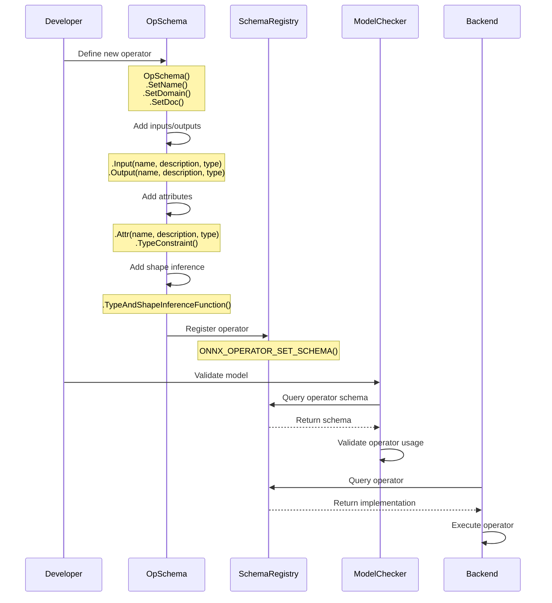
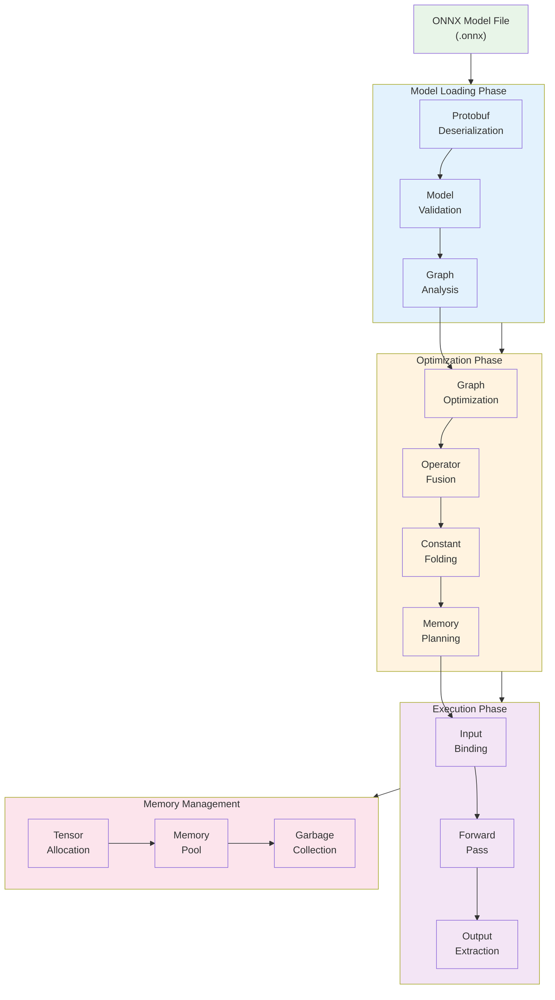
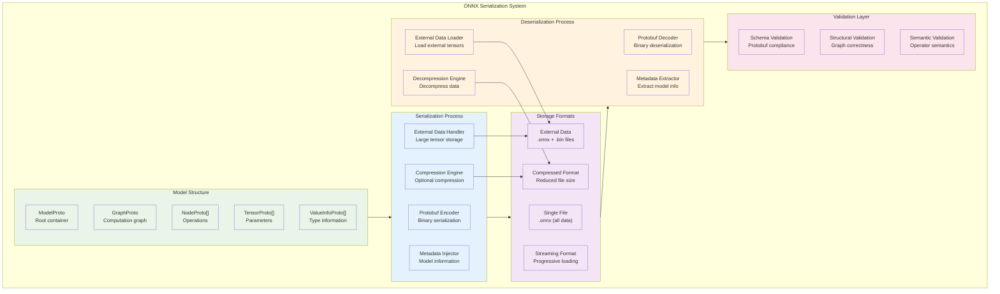

<!--
Copyright (c) ONNX Project Contributors

SPDX-License-Identifier: Apache-2.0
-->

# ONNX Detailed Implementation Architecture

This document provides detailed implementation-level architecture diagrams for developers working with ONNX internals.

## Core Components Detailed Architecture

```mermaid
graph TB
    subgraph CoreComponents["ONNX Core Components"]
        subgraph ProtoDefinitions["Protocol Buffer Definitions"]
            ONNXProto["onnx.proto<br/>Core message definitions"]
            DataProto["onnx-data.proto<br/>Data type definitions"]
            OperatorsProto["onnx-operators.proto<br/>Operator definitions"]
            MLProto["onnx-ml.proto<br/>ML extensions"]
        end
        
        subgraph CppCore["C++ Core Implementation"]
            Checker["checker.cc<br/>Model validation"]
            Parser["parser.cc<br/>Model parsing"]
            Printer["printer.cc<br/>Model serialization"]
            ShapeInfCpp["shape_inference.cc<br/>Shape inference engine"]
            SchemaRegistry["schema.cc<br/>Operator registry"]
        end
        
        subgraph PythonBindings["Python Bindings"]
            PyChecker["checker.py<br/>Python model checker"]
            PyHelper["helper.py<br/>Model construction"]
            PyShapeInf["shape_inference.py<br/>Python shape inference"]
            PyUtils["utils.py<br/>Utility functions"]
        end
        
        subgraph Tools["Development Tools"]
            GenDoc["gen_doc.py<br/>Documentation generator"]
            GenProto["gen_proto.py<br/>Protobuf generator"]
            VersionConverter["version_converter.py<br/>Model version conversion"]
        end
    end
    
    ProtoDefinitions --> CppCore
    CppCore --> PythonBindings
    PythonBindings --> Tools
    
    %% Styling
    classDef proto fill:#e8f5e8
    classDef cpp fill:#e3f2fd
    classDef python fill:#fff3e0
    classDef tools fill:#f3e5f5
    
    class ONNXProto,DataProto,OperatorsProto,MLProto,ProtoDefinitions proto
    class Checker,Parser,Printer,ShapeInfCpp,SchemaRegistry,CppCore cpp
    class PyChecker,PyHelper,PyShapeInf,PyUtils,PythonBindings python
    class GenDoc,GenProto,VersionConverter,Tools tools
```



## Operator Definition and Registration System



## Model Loading and Execution Pipeline



## Type System Implementation

```mermaid
graph TB
    subgraph TypeSystem["ONNX Type System Implementation"]
        subgraph TypeProto["TypeProto Structure"]
            TensorType["tensor_type<br/>Dense tensor"]
            SequenceType["sequence_type<br/>Sequence container"]
            MapType["map_type<br/>Key-value mapping"]
            OptionalType["optional_type<br/>Optional values"]
            SparseTensorType["sparse_tensor_type<br/>Sparse tensor"]
        end
        
        subgraph TensorDetails["Tensor Type Details"]
            ElemType["elem_type<br/>Element data type"]
            Shape["shape<br/>Tensor dimensions"]
            Denotation["denotation<br/>Semantic meaning"]
        end
        
        subgraph DataTypes["Primitive Data Types"]
            Float16["FLOAT16<br/>Half precision"]
            Float32["FLOAT<br/>Single precision"]
            Float64["DOUBLE<br/>Double precision"]
            Int8["INT8<br/>Signed 8-bit"]
            Int16["INT16<br/>Signed 16-bit"]
            Int32["INT32<br/>Signed 32-bit"]
            Int64["INT64<br/>Signed 64-bit"]
            UInt8["UINT8<br/>Unsigned 8-bit"]
            UInt16["UINT16<br/>Unsigned 16-bit"]
            UInt32["UINT32<br/>Unsigned 32-bit"]
            UInt64["UINT64<br/>Unsigned 64-bit"]
            Bool["BOOL<br/>Boolean"]
            String["STRING<br/>UTF-8 string"]
            Complex64["COMPLEX64<br/>Complex float"]
            Complex128["COMPLEX128<br/>Complex double"]
        end
        
        subgraph ShapeInfo["Shape Information"]
            DimValue["dim_value<br/>Concrete dimension"]
            DimParam["dim_param<br/>Symbolic dimension"]
            DimUnknown["Unknown dimension"]
        end
        
        subgraph TypeConstraints["Type Constraints"]
            AllowedTypes["allowed_type_strs<br/>Valid types"]
            TypeRelations["Type relationships"]
            BroadcastRules["Broadcasting rules"]
        end
    end
    
    TensorType --> TensorDetails
    TensorDetails --> ElemType
    TensorDetails --> Shape
    ElemType --> DataTypes
    Shape --> ShapeInfo
    
    TypeConstraints --> AllowedTypes
    TypeConstraints --> TypeRelations
    
    %% Styling
    classDef typeproto fill:#e8f5e8
    classDef tensor fill:#e3f2fd
    classDef datatypes fill:#fff3e0
    classDef shape fill:#f3e5f5
    classDef constraints fill:#fce4ec
    
    class TensorType,SequenceType,MapType,OptionalType,SparseTensorType,TypeProto typeproto
    class ElemType,Shape,Denotation,TensorDetails tensor
    class Float16,Float32,Float64,Int8,Int16,Int32,Int64,UInt8,UInt16,UInt32,UInt64,Bool,String,Complex64,Complex128,DataTypes datatypes
    class DimValue,DimParam,DimUnknown,ShapeInfo shape
    class AllowedTypes,TypeRelations,BroadcastRules,TypeConstraints constraints
```



## Shape Inference Implementation Details

```mermaid
graph TB
    subgraph ShapeInferenceSystem["Shape Inference Implementation"]
        subgraph GraphLevel["Graph-Level Inference"]
            GraphWalker["Graph Walker<br/>Topological traversal"]
            SymbolTable["Symbol Table<br/>Dimension symbols"]
            ValueTracker["Value Tracker<br/>Intermediate values"]
            MergeStrategy["Merge Strategy<br/>Shape reconciliation"]
        end
        
        subgraph NodeLevel["Node-Level Inference"]
            OpSchemaLookup["OpSchema Lookup<br/>Find operator definition"]
            TypeInference["Type Inference<br/>Infer output types"]
            ShapeFunction["Shape Function<br/>Compute output shapes"]
            BroadcastLogic["Broadcast Logic<br/>Handle broadcasting"]
        end
        
        subgraph SymbolicSystem["Symbolic Shape System"]
            SymbolGeneration["Symbol Generation<br/>Create new symbols"]
            SymbolPropagation["Symbol Propagation<br/>Pass symbols forward"]
            SymbolSubstitution["Symbol Substitution<br/>Replace with values"]
            ConstraintSolver["Constraint Solver<br/>Resolve relationships"]
        end
        
        subgraph DataPropagation["Data Propagation"]
            ConstantPropagation["Constant Propagation<br/>Forward known values"]
            PartialEvaluation["Partial Evaluation<br/>Compute when possible"]
            ValueSpecialization["Value Specialization<br/>Optimize for constants"]
        end
        
        subgraph ErrorHandling["Error Handling"]
            ShapeConflicts["Shape Conflicts<br/>Incompatible shapes"]
            TypeMismatches["Type Mismatches<br/>Invalid type usage"]
            UnknownOperators["Unknown Operators<br/>Missing definitions"]
            ValidationErrors["Validation Errors<br/>Report issues"]
        end
    end
    
    GraphLevel --> NodeLevel
    NodeLevel --> SymbolicSystem
    SymbolicSystem --> DataPropagation
    DataPropagation --> ErrorHandling
    
    %% Cross-connections
    GraphWalker --> OpSchemaLookup
    TypeInference --> SymbolGeneration
    ShapeFunction --> ConstantPropagation
    BroadcastLogic --> ConstraintSolver
    
    %% Styling
    classDef graph fill:#e8f5e8
    classDef node fill:#e3f2fd
    classDef symbolic fill:#fff3e0
    classDef data fill:#f3e5f5
    classDef error fill:#ffcdd2
    
    class GraphWalker,SymbolTable,ValueTracker,MergeStrategy,GraphLevel graph
    class OpSchemaLookup,TypeInference,ShapeFunction,BroadcastLogic,NodeLevel node
    class SymbolGeneration,SymbolPropagation,SymbolSubstitution,ConstraintSolver,SymbolicSystem symbolic
    class ConstantPropagation,PartialEvaluation,ValueSpecialization,DataPropagation data
    class ShapeConflicts,TypeMismatches,UnknownOperators,ValidationErrors,ErrorHandling error
```

## Backend Provider Architecture

```mermaid
graph TB
    subgraph BackendArchitecture["Backend Provider Architecture"]
        subgraph ProviderInterface["Provider Interface"]
            IExecutionProvider["IExecutionProvider<br/>Base interface"]
            ProviderCapabilities["Provider Capabilities<br/>Supported ops/types"]
            ProviderOptions["Provider Options<br/>Configuration"]
        end
        
        subgraph CPUProvider["CPU Execution Provider"]
            CPUKernels["CPU Kernels<br/>Optimized implementations"]
            CPUMemoryAllocator["CPU Memory Allocator<br/>System memory"]
            CPUThreading["CPU Threading<br/>Parallel execution"]
            CPUOptimizations["CPU Optimizations<br/>SIMD, vectorization"]
        end
        
        subgraph GPUProvider["GPU Execution Provider"]
            CUDAKernels["CUDA Kernels<br/>GPU implementations"]
            GPUMemoryManager["GPU Memory Manager<br/>Device memory"]
            StreamManager["Stream Manager<br/>Async execution"]
            CUBLASIntegration["cuBLAS Integration<br/>Optimized BLAS"]
        end
        
        subgraph SpecializedProviders["Specialized Providers"]
            TensorRTProvider["TensorRT Provider<br/>NVIDIA optimization"]
            OpenVINOProvider["OpenVINO Provider<br/>Intel optimization"]
            DirectMLProvider["DirectML Provider<br/>Windows GPU"]
            CustomProvider["Custom Provider<br/>User-defined"]
        end
        
        subgraph KernelRegistration["Kernel Registration"]
            KernelDef["Kernel Definition<br/>Implementation metadata"]
            OpKernelInfo["OpKernel Info<br/>Operator kernel binding"]
            TypeConstraints["Type Constraints<br/>Supported types"]
            DeviceConstraints["Device Constraints<br/>Hardware requirements"]
        end
    end
    
    ProviderInterface --> CPUProvider
    ProviderInterface --> GPUProvider
    ProviderInterface --> SpecializedProviders
    
    CPUProvider --> KernelRegistration
    GPUProvider --> KernelRegistration
    SpecializedProviders --> KernelRegistration
    
    %% Styling
    classDef interface fill:#e8f5e8
    classDef cpu fill:#e3f2fd
    classDef gpu fill:#fff3e0
    classDef specialized fill:#f3e5f5
    classDef registration fill:#fce4ec
    
    class IExecutionProvider,ProviderCapabilities,ProviderOptions,ProviderInterface interface
    class CPUKernels,CPUMemoryAllocator,CPUThreading,CPUOptimizations,CPUProvider cpu
    class CUDAKernels,GPUMemoryManager,StreamManager,CUBLASIntegration,GPUProvider gpu
    class TensorRTProvider,OpenVINOProvider,DirectMLProvider,CustomProvider,SpecializedProviders specialized
    class KernelDef,OpKernelInfo,TypeConstraints,DeviceConstraints,KernelRegistration registration
```



## Graph Optimization Pipeline

```mermaid
flowchart LR
    OriginalGraph["Original<br/>ONNX Graph"]
    
    subgraph L1Optimizations["Level 1 Optimizations"]
        ConstantFolding["Constant<br/>Folding"]
        RedundantElimination["Redundant Node<br/>Elimination"]
        IdentityElimination["Identity<br/>Elimination"]
        NoopElimination["No-op<br/>Elimination"]
    end
    
    subgraph L2Optimizations["Level 2 Optimizations"]
        OperatorFusion["Operator<br/>Fusion"]
        MatMulFusion["MatMul<br/>Fusion"]
        ConvFusion["Conv<br/>Fusion"]
        BatchNormFusion["BatchNorm<br/>Fusion"]
    end
    
    subgraph L3Optimizations["Level 3 Optimizations"]
        LayoutOptimization["Layout<br/>Optimization"]
        MemoryOptimization["Memory<br/>Optimization"]
        ComputeOptimization["Compute<br/>Optimization"]
        GraphPartitioning["Graph<br/>Partitioning"]
    end
    
    OptimizedGraph["Optimized<br/>ONNX Graph"]
    
    OriginalGraph --> L1Optimizations
    L1Optimizations --> L2Optimizations
    L2Optimizations --> L3Optimizations
    L3Optimizations --> OptimizedGraph
    
    %% Detailed flow within levels
    ConstantFolding --> RedundantElimination
    RedundantElimination --> IdentityElimination
    IdentityElimination --> NoopElimination
    
    OperatorFusion --> MatMulFusion
    MatMulFusion --> ConvFusion
    ConvFusion --> BatchNormFusion
    
    LayoutOptimization --> MemoryOptimization
    MemoryOptimization --> ComputeOptimization
    ComputeOptimization --> GraphPartitioning
    
    %% Styling
    classDef graph fill:#e8f5e8
    classDef level1 fill:#e3f2fd
    classDef level2 fill:#fff3e0
    classDef level3 fill:#f3e5f5
    
    class OriginalGraph,OptimizedGraph graph
    class ConstantFolding,RedundantElimination,IdentityElimination,NoopElimination,L1Optimizations level1
    class OperatorFusion,MatMulFusion,ConvFusion,BatchNormFusion,L2Optimizations level2
    class LayoutOptimization,MemoryOptimization,ComputeOptimization,GraphPartitioning,L3Optimizations level3
```

## ONNX Model Serialization Architecture



## Summary

This detailed implementation architecture covers the internal workings of ONNX, including:

1. **Core Components**: Protocol buffer definitions, C++ implementation, Python bindings, and tools
2. **Operator System**: Registration and validation of operators with schemas
3. **Model Pipeline**: Complete loading, optimization, and execution flow
4. **Type System**: Comprehensive type definitions and constraints
5. **Shape Inference**: Detailed implementation of shape and type inference
6. **Backend Providers**: Architecture for different execution backends
7. **Graph Optimization**: Multi-level optimization pipeline
8. **Model Serialization**: Complete serialization and deserialization architecture

These diagrams provide developers with a clear understanding of ONNX's internal architecture and implementation details, enabling effective contribution to the project and integration with external systems.