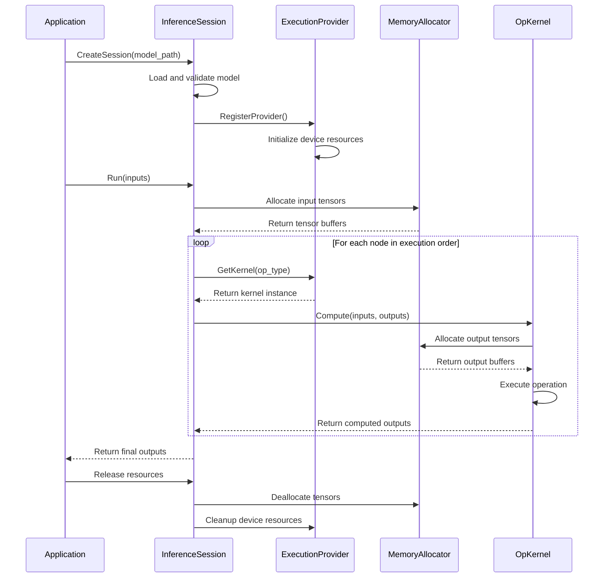
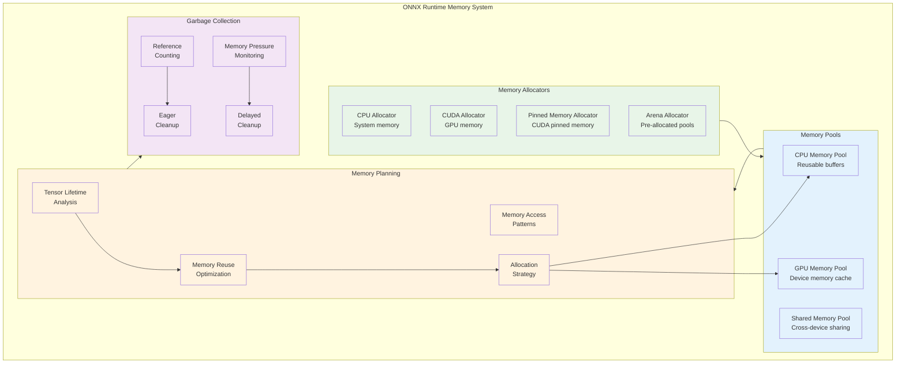
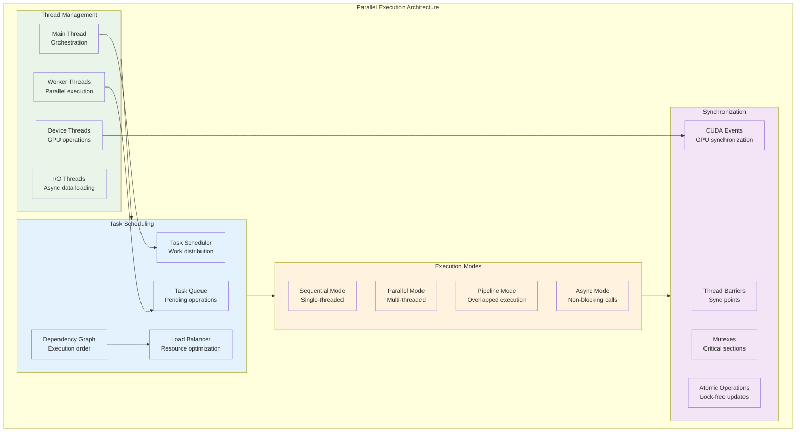
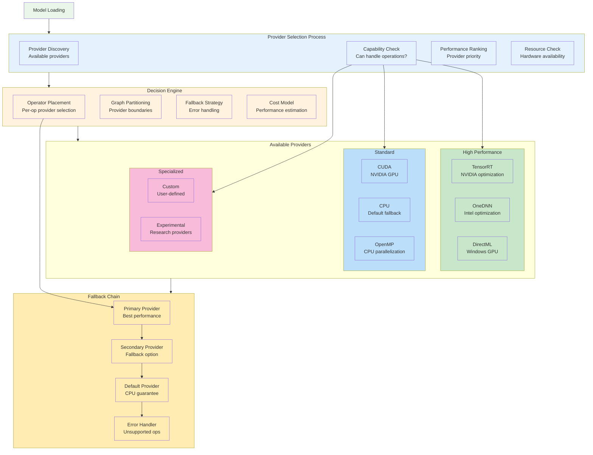
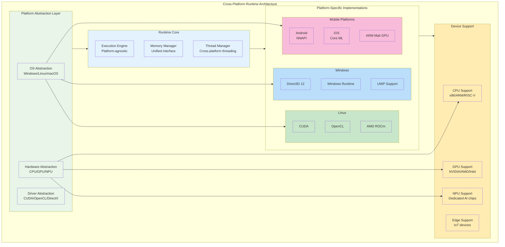
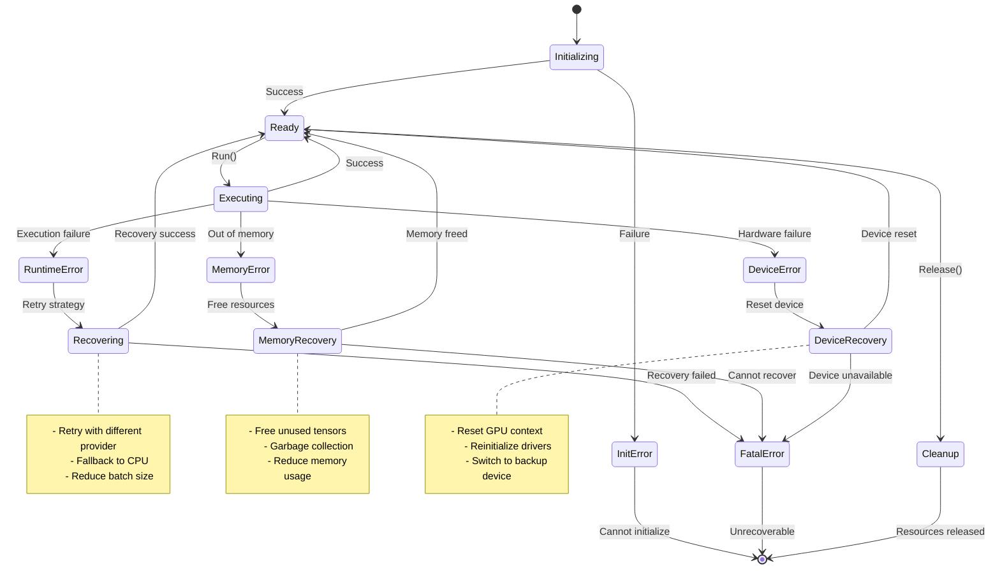

<!--
Copyright (c) ONNX Project Contributors

SPDX-License-Identifier: Apache-2.0
-->

# ONNX Runtime Architecture

This document provides detailed architecture diagrams specifically focused on ONNX runtime execution patterns and backend integration.

## Runtime Execution Flow

## Memory Management Architecture

## Parallel Execution Architecture

## Provider Selection and Fallback

## Cross-Platform Runtime Architecture

## Runtime Performance Optimization

```mermaid
graph TB
    subgraph PerformanceOptimization["Runtime Performance Optimization"]
        subgraph ProfilingSystem["Profiling System"]
            CPUProfiler["CPU Profiler<br/>Execution timing"]
            MemoryProfiler["Memory Profiler<br/>Usage tracking"]
            GPUProfiler["GPU Profiler<br/>Kernel timing"]
            NetworkProfiler["Network Profiler<br/>Model structure"]
        end
        
        subgraph OptimizationStrategies["Optimization Strategies"]
            StaticOptimization["Static Optimization<br/>Compile-time"]
            DynamicOptimization["Dynamic Optimization<br/>Runtime adaptation"]
            CacheOptimization["Cache Optimization<br/>Data locality"]
            KernelFusion["Kernel Fusion<br/>Reduce overhead"]
        end
        
        subgraph AdaptiveOptimization["Adaptive Optimization"]
            RuntimeAdaptation["Runtime Adaptation<br/>Dynamic tuning"]
            LoadBalancing["Load Balancing<br/>Resource distribution"]
            PowerManagement["Power Management<br/>Energy efficiency"]
            ThermalThrottling["Thermal Throttling<br/>Temperature control"]
        end
        
        subgraph Benchmarking["Benchmarking & Monitoring"]
            PerformanceMetrics["Performance Metrics<br/>Latency/throughput"]
            ResourceUtilization["Resource Utilization<br/>CPU/GPU/Memory"]
            PowerConsumption["Power Consumption<br/>Energy monitoring"]
            SystemHealth["System Health<br/>Overall status"]
        end
        
        subgraph OptimizationTechniques["Optimization Techniques"]
            Quantization["Quantization<br/>Reduced precision"]
            Pruning["Model Pruning<br/>Remove redundancy"]
            OperatorFusion["Operator Fusion<br/>Combine operations"]
            MemoryOptimization["Memory Optimization<br/>Reduce footprint"]
        end
    end
    
    ProfilingSystem --> OptimizationStrategies
    OptimizationStrategies --> AdaptiveOptimization
    AdaptiveOptimization --> Benchmarking
    Benchmarking --> OptimizationTechniques
    
    %% Cross-connections
    CPUProfiler --> StaticOptimization
    MemoryProfiler --> CacheOptimization
    GPUProfiler --> KernelFusion
    RuntimeAdaptation --> LoadBalancing
    
    %% Styling
    classDef profiling fill:#e8f5e8
    classDef optimization fill:#e3f2fd
    classDef adaptive fill:#fff3e0
    classDef benchmark fill:#f3e5f5
    classDef techniques fill:#fce4ec
    
    class CPUProfiler,MemoryProfiler,GPUProfiler,NetworkProfiler,ProfilingSystem profiling
    class StaticOptimization,DynamicOptimization,CacheOptimization,KernelFusion,OptimizationStrategies optimization
    class RuntimeAdaptation,LoadBalancing,PowerManagement,ThermalThrottling,AdaptiveOptimization adaptive
    class PerformanceMetrics,ResourceUtilization,PowerConsumption,SystemHealth,Benchmarking benchmark
    class Quantization,Pruning,OperatorFusion,MemoryOptimization,OptimizationTechniques techniques
```

## Runtime Error Handling and Recovery

## Summary

This runtime architecture documentation provides comprehensive coverage of:

1. **Runtime Execution Flow**: Detailed sequence of operations during model inference
2. **Memory Management**: Sophisticated memory allocation and optimization strategies
3. **Parallel Execution**: Multi-threaded and multi-device execution patterns
4. **Provider Selection**: Intelligent backend selection with fallback mechanisms
5. **Cross-Platform Support**: Architecture for supporting diverse platforms and devices
6. **Performance Optimization**: Runtime optimization techniques and adaptive strategies
7. **Error Handling**: Robust error recovery and fallback mechanisms

These diagrams help developers understand how ONNX runtime operates in production environments, enabling better optimization strategies and more robust application development.